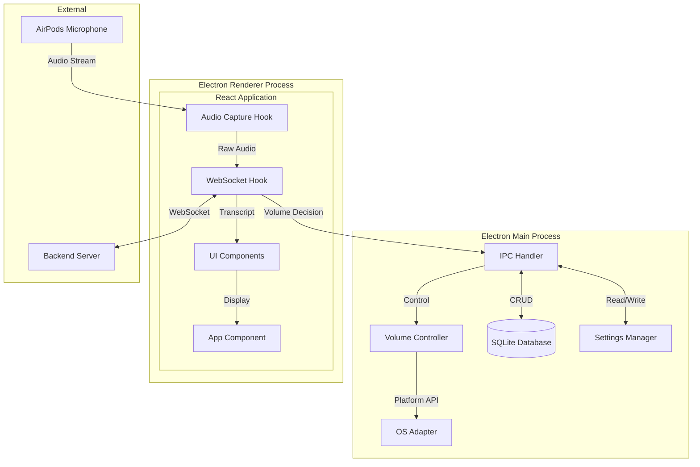

# Smart Volume Control - Design Document

## Overview

The Smart Volume Control application is an Electron + React desktop application that intelligently manages system audio volume based on real-time conversation detection. The application captures audio from AirPods microphone, streams it to a backend service via WebSocket for speech analysis, and automatically adjusts system volume when someone attempts to converse with the user.

Key capabilities:
- Real-time audio capture from AirPods microphone using Web Audio API
- WebSocket-based streaming to backend with automatic reconnection
- Cross-platform volume control (Windows, macOS, Linux)
- Live transcript display with trigger phrase highlighting
- Persistent chat history with search and filtering
- Configurable settings with immediate persistence

## Architecture



### Technology Stack

- **Framework**: Electron 28+ with React 18+
- **Language**: TypeScript
- **State Management**: React Context + useReducer
- **Database**: SQLite via better-sqlite3 (synchronous, embedded)
- **Styling**: Tailwind CSS
- **Build Tool**: Vite with electron-vite
- **Testing**: Vitest + fast-check (property-based testing)

## Components and Interfaces

### 1. Audio Capture Module (Renderer Process)

```typescript
interface AudioCaptureConfig {
  deviceId: string;
  sampleRate: number;      // Default: 16000 Hz
  channelCount: number;    // Default: 1 (mono)
  bufferSize: number;      // Default: 4096 samples
}

interface AudioCaptureState {
  isCapturing: boolean;
  currentDevice: MediaDeviceInfo | null;
  audioLevel: number;      // 0-100 normalized level
  error: string | null;
}

interface UseAudioCapture {
  state: AudioCaptureState;
  startCapture: (config: AudioCaptureConfig) => Promise<void>;
  stopCapture: () => void;
  getDevices: () => Promise<MediaDeviceInfo[]>;
  onAudioData: (callback: (data: Float32Array) => void) => void;
}
```

### 2. WebSocket Client (Renderer Process)

```typescript
type ConnectionStatus = 'disconnected' | 'connecting' | 'connected' | 'reconnecting';

interface WebSocketConfig {
  url: string;
  reconnectAttempts: number;  // Default: 5
  reconnectBaseDelay: number; // Default: 1000ms
}

interface WebSocketState {
  status: ConnectionStatus;
  reconnectCount: number;
  lastError: string | null;
}

type VolumeDecision = 'LOWER_VOLUME' | 'RESTORE_VOLUME';

interface TranscriptMessage {
  id: string;
  text: string;
  timestamp: number;
  triggerPhrase: string | null;
  decision: VolumeDecision | null;
}

interface UseWebSocket {
  state: WebSocketState;
  connect: (config: WebSocketConfig) => void;
  disconnect: () => void;
  sendAudio: (data: Float32Array) => void;
  onDecision: (callback: (decision: VolumeDecision) => void) => void;
  onTranscript: (callback: (transcript: TranscriptMessage) => void) => void;
}
```

### 3. Volume Controller (Main Process)

```typescript
type VolumeState = 'normal' | 'dimmed';

interface VolumeControllerConfig {
  dimLevel: number;           // 0-100, target volume when dimmed
  transitionDuration: number; // Default: 200ms
}

interface VolumeStatus {
  currentLevel: number;       // 0-100
  previousLevel: number;      // Level before dimming
  state: VolumeState;
}

interface IVolumeController {
  getVolume(): Promise<number>;
  setVolume(level: number, smooth?: boolean): Promise<void>;
  dimVolume(targetLevel: number): Promise<void>;
  restoreVolume(): Promise<void>;
  getStatus(): VolumeStatus;
}
```

### 4. OS Adapter Interface (Main Process)

```typescript
type Platform = 'win32' | 'darwin' | 'linux';

interface IOSAdapter {
  platform: Platform;
  getSystemVolume(): Promise<number>;
  setSystemVolume(level: number): Promise<void>;
  isSupported(): boolean;
}

// Platform-specific implementations
class WindowsVolumeAdapter implements IOSAdapter { /* Uses nircmd or PowerShell */ }
class MacOSVolumeAdapter implements IOSAdapter { /* Uses osascript */ }
class LinuxVolumeAdapter implements IOSAdapter { /* Uses pactl or amixer */ }
```

### 5. Chat History Database (Main Process)

```typescript
interface ChatHistoryEntry {
  id: string;
  sessionId: string;
  text: string;
  timestamp: number;
  triggerPhrase: string | null;
  decision: VolumeDecision | null;
}

interface ChatHistoryQuery {
  startDate?: number;
  endDate?: number;
  searchText?: string;
  limit?: number;
  offset?: number;
}

interface IChatHistoryRepository {
  save(entry: Omit<ChatHistoryEntry, 'id'>): ChatHistoryEntry;
  findAll(query: ChatHistoryQuery): ChatHistoryEntry[];
  findById(id: string): ChatHistoryEntry | null;
  delete(id: string): boolean;
  deleteByDateRange(startDate: number, endDate: number): number;
  count(query?: ChatHistoryQuery): number;
}
```

### 6. Settings Manager (Main Process)

```typescript
interface AppSettings {
  serverUrl: string;
  dimLevel: number;
  selectedDeviceId: string | null;
  transitionDuration: number;
}

interface ISettingsManager {
  get<K extends keyof AppSettings>(key: K): AppSettings[K];
  set<K extends keyof AppSettings>(key: K, value: AppSettings[K]): void;
  getAll(): AppSettings;
  reset(): void;
}
```

### 7. IPC Communication

```typescript
// Main process handlers
interface MainProcessAPI {
  // Volume control
  'volume:get': () => Promise<number>;
  'volume:set': (level: number) => Promise<void>;
  'volume:dim': (targetLevel: number) => Promise<void>;
  'volume:restore': () => Promise<void>;
  'volume:status': () => VolumeStatus;
  
  // Chat history
  'history:save': (entry: Omit<ChatHistoryEntry, 'id'>) => ChatHistoryEntry;
  'history:query': (query: ChatHistoryQuery) => ChatHistoryEntry[];
  'history:delete': (id: string) => boolean;
  'history:count': (query?: ChatHistoryQuery) => number;
  
  // Settings
  'settings:get': () => AppSettings;
  'settings:set': (settings: Partial<AppSettings>) => void;
  
  // Platform
  'platform:get': () => Platform;
}
```

## Data Models

### Database Schema (SQLite)

```sql
-- Chat history table
CREATE TABLE chat_history (
  id TEXT PRIMARY KEY,
  session_id TEXT NOT NULL,
  text TEXT NOT NULL,
  timestamp INTEGER NOT NULL,
  trigger_phrase TEXT,
  decision TEXT CHECK(decision IN ('LOWER_VOLUME', 'RESTORE_VOLUME')),
  created_at INTEGER DEFAULT (strftime('%s', 'now'))
);

CREATE INDEX idx_chat_history_timestamp ON chat_history(timestamp);
CREATE INDEX idx_chat_history_session ON chat_history(session_id);

-- Settings table
CREATE TABLE settings (
  key TEXT PRIMARY KEY,
  value TEXT NOT NULL,
  updated_at INTEGER DEFAULT (strftime('%s', 'now'))
);
```

### Application State (React Context)

```typescript
interface AppState {
  // Audio capture state
  audio: {
    isCapturing: boolean;
    currentDevice: MediaDeviceInfo | null;
    audioLevel: number;
    availableDevices: MediaDeviceInfo[];
  };
  
  // WebSocket state
  connection: {
    status: ConnectionStatus;
    reconnectCount: number;
    lastError: string | null;
  };
  
  // Volume state
  volume: {
    currentLevel: number;
    previousLevel: number;
    state: VolumeState;
  };
  
  // Transcript state
  transcript: {
    entries: TranscriptMessage[];
    isAutoScrollEnabled: boolean;
  };
  
  // Settings
  settings: AppSettings;
}

type AppAction =
  | { type: 'AUDIO_START'; device: MediaDeviceInfo }
  | { type: 'AUDIO_STOP' }
  | { type: 'AUDIO_LEVEL_UPDATE'; level: number }
  | { type: 'AUDIO_DEVICES_UPDATE'; devices: MediaDeviceInfo[] }
  | { type: 'CONNECTION_STATUS_CHANGE'; status: ConnectionStatus }
  | { type: 'CONNECTION_ERROR'; error: string }
  | { type: 'VOLUME_UPDATE'; status: VolumeStatus }
  | { type: 'TRANSCRIPT_ADD'; entry: TranscriptMessage }
  | { type: 'TRANSCRIPT_CLEAR' }
  | { type: 'SETTINGS_UPDATE'; settings: Partial<AppSettings> };
```

### WebSocket Message Protocol

```typescript
// Client -> Server (Audio data)
interface AudioMessage {
  type: 'audio';
  data: string;        // Base64 encoded Float32Array
  timestamp: number;
  sampleRate: number;
}

// Server -> Client (Decision)
interface DecisionMessage {
  type: 'decision';
  decision: VolumeDecision;
  confidence: number;
  triggerPhrase: string | null;
}

// Server -> Client (Transcript)
interface TranscriptUpdateMessage {
  type: 'transcript';
  id: string;
  text: string;
  timestamp: number;
  isFinal: boolean;
}
```


## Correctness Properties

*A property is a characteristic or behavior that should hold true across all valid executions of a system-essentially, a formal statement about what the system should do. Properties serve as the bridge between human-readable specifications and machine-verifiable correctness guarantees.*

Based on the acceptance criteria analysis, the following correctness properties must be validated through property-based testing:

### Property 1: Audio capture state consistency
*For any* permission grant event, the audio capture state SHALL transition to capturing with the selected device active.
**Validates: Requirements 1.1**

### Property 2: Audio streaming continuity
*For any* active audio capture session, audio data callbacks SHALL be invoked with non-empty data buffers.
**Validates: Requirements 1.2**

### Property 3: Device selection availability
*For any* set of available audio input devices, all devices SHALL be selectable and the selected device SHALL be reflected in the capture configuration.
**Validates: Requirements 1.4**

### Property 4: Audio streaming while connected
*For any* active WebSocket connection and active audio capture, audio data SHALL be transmitted to the backend.
**Validates: Requirements 2.2**

### Property 5: Reconnection with exponential backoff
*For any* WebSocket disconnection event, reconnection attempts SHALL occur with delays that increase exponentially (delay = baseDelay * 2^attemptNumber).
**Validates: Requirements 2.4**

### Property 6: Volume dim/restore round-trip
*For any* initial volume level and dim level setting, receiving LOWER_VOLUME followed by RESTORE_VOLUME SHALL return the volume to the original level.
**Validates: Requirements 3.1, 3.2**

### Property 7: Volume state UI consistency
*For any* volume state (normal or dimmed), the UI SHALL display the corresponding visual indicator matching that state.
**Validates: Requirements 3.3**

### Property 8: Transcript auto-scroll behavior
*For any* new transcript entry added while auto-scroll is enabled, the scroll position SHALL update to show the latest entry.
**Validates: Requirements 4.2**

### Property 9: Trigger phrase highlighting
*For any* transcript entry with a non-null trigger phrase, the rendered entry SHALL include highlight styling for that phrase.
**Validates: Requirements 4.4**

### Property 10: Chat history persistence round-trip
*For any* transcript entry saved to the database, querying the database SHALL return that entry with all fields intact including timestamp.
**Validates: Requirements 5.1, 5.2**

### Property 11: Date range filtering correctness
*For any* date range query (startDate, endDate), all returned entries SHALL have timestamps within that range, and no entries outside the range SHALL be returned.
**Validates: Requirements 5.3**

### Property 12: Text search filtering correctness
*For any* search query string, all returned entries SHALL contain that string in their text field (case-insensitive), and no entries without the string SHALL be returned.
**Validates: Requirements 5.4**

### Property 13: History deletion completeness
*For any* entry deletion request, the deleted entry SHALL NOT be retrievable from the database afterward.
**Validates: Requirements 5.5**

### Property 14: Platform adapter selection
*For any* detected platform (win32, darwin, linux), the corresponding OS adapter SHALL be loaded and report that platform.
**Validates: Requirements 6.4**

### Property 15: Settings persistence round-trip
*For any* settings modification, the new value SHALL be immediately retrievable and SHALL persist across simulated application restarts.
**Validates: Requirements 7.3, 7.4**

### Property 16: Connection status UI reflection
*For any* WebSocket connection status change, the UI state SHALL reflect the current status (connected/disconnected/reconnecting).
**Validates: Requirements 8.1**

### Property 17: Audio level indicator updates
*For any* active audio capture with varying input levels, the displayed audio level SHALL update to reflect the current input amplitude.
**Validates: Requirements 8.2**

### Property 18: Volume state display accuracy
*For any* volume state change, the UI SHALL display both the current volume level and the correct state label (normal/dimmed).
**Validates: Requirements 8.3**

### Property 19: Error notification generation
*For any* error event, a notification SHALL be generated containing an actionable error message.
**Validates: Requirements 8.4**

## Error Handling

### Audio Capture Errors

| Error Condition | Handling Strategy | User Feedback |
|----------------|-------------------|---------------|
| Permission denied | Set error state, stop capture attempt | "Microphone access required. Please grant permission in system settings." |
| Device not found | Refresh device list, prompt selection | "Selected microphone not found. Please select another device." |
| Device in use | Retry with backoff, then fail | "Microphone is in use by another application." |
| Stream interrupted | Attempt restart, notify if persistent | "Audio capture interrupted. Attempting to restart..." |

### WebSocket Errors

| Error Condition | Handling Strategy | User Feedback |
|----------------|-------------------|---------------|
| Connection failed | Exponential backoff retry (5 attempts) | "Connecting to server..." / "Connection failed. Retrying..." |
| Connection lost | Immediate reconnection attempt | "Connection lost. Reconnecting..." |
| Max retries exceeded | Stop retrying, require manual reconnect | "Unable to connect to server. Check your network and server URL." |
| Invalid message | Log error, continue processing | Silent (logged for debugging) |

### Volume Control Errors

| Error Condition | Handling Strategy | User Feedback |
|----------------|-------------------|---------------|
| API unavailable | Fall back to alternative method if available | "Volume control unavailable on this system." |
| Permission denied | Request elevated permissions or notify | "Unable to control system volume. Administrator access may be required." |
| Invalid level | Clamp to valid range (0-100) | Silent (auto-corrected) |

### Database Errors

| Error Condition | Handling Strategy | User Feedback |
|----------------|-------------------|---------------|
| Database locked | Retry with timeout | Silent retry, then "Database busy. Please try again." |
| Disk full | Notify user, suggest cleanup | "Storage full. Consider clearing old history." |
| Corruption detected | Attempt recovery, backup and recreate if needed | "Database error. Some history may be lost." |

## Testing Strategy

### Property-Based Testing Framework

The application will use **fast-check** as the property-based testing library for TypeScript/JavaScript. fast-check provides:
- Arbitrary generators for complex data types
- Shrinking for minimal failing examples
- Integration with Vitest test runner

Each property-based test will:
- Run a minimum of 100 iterations
- Be tagged with the format: `**Feature: smart-volume-control, Property {number}: {property_text}**`
- Reference the specific correctness property from this design document

### Unit Testing Approach

Unit tests will cover:
- Specific edge cases (empty inputs, boundary values)
- Error condition handling
- Integration points between components
- OS-specific adapter behavior (mocked)

### Test Organization

```
frontend/
├── src/
│   ├── hooks/
│   │   ├── useAudioCapture.ts
│   │   ├── useAudioCapture.test.ts      # Unit tests
│   │   ├── useAudioCapture.property.test.ts  # Property tests
│   │   ├── useWebSocket.ts
│   │   └── useWebSocket.test.ts
│   ├── services/
│   │   ├── volumeController.ts
│   │   ├── volumeController.test.ts
│   │   └── volumeController.property.test.ts
│   ├── repositories/
│   │   ├── chatHistoryRepository.ts
│   │   ├── chatHistoryRepository.test.ts
│   │   └── chatHistoryRepository.property.test.ts
│   └── utils/
│       ├── settingsManager.ts
│       └── settingsManager.property.test.ts
```

### Testing Tools

- **Vitest**: Test runner with fast execution and native ESM support
- **fast-check**: Property-based testing library
- **@testing-library/react**: React component testing
- **better-sqlite3**: In-memory SQLite for database tests

### Example Property Test Structure

```typescript
import { describe, it, expect } from 'vitest';
import * as fc from 'fast-check';

describe('ChatHistoryRepository', () => {
  /**
   * **Feature: smart-volume-control, Property 10: Chat history persistence round-trip**
   * **Validates: Requirements 5.1, 5.2**
   */
  it('should persist and retrieve entries with all fields intact', () => {
    fc.assert(
      fc.property(
        fc.record({
          sessionId: fc.string({ minLength: 1 }),
          text: fc.string({ minLength: 1 }),
          timestamp: fc.integer({ min: 0 }),
          triggerPhrase: fc.option(fc.string(), { nil: null }),
          decision: fc.option(
            fc.constantFrom('LOWER_VOLUME', 'RESTORE_VOLUME'),
            { nil: null }
          ),
        }),
        (entry) => {
          const saved = repository.save(entry);
          const retrieved = repository.findById(saved.id);
          
          expect(retrieved).not.toBeNull();
          expect(retrieved?.text).toBe(entry.text);
          expect(retrieved?.timestamp).toBe(entry.timestamp);
          expect(retrieved?.triggerPhrase).toBe(entry.triggerPhrase);
          expect(retrieved?.decision).toBe(entry.decision);
        }
      ),
      { numRuns: 100 }
    );
  });
});
```
